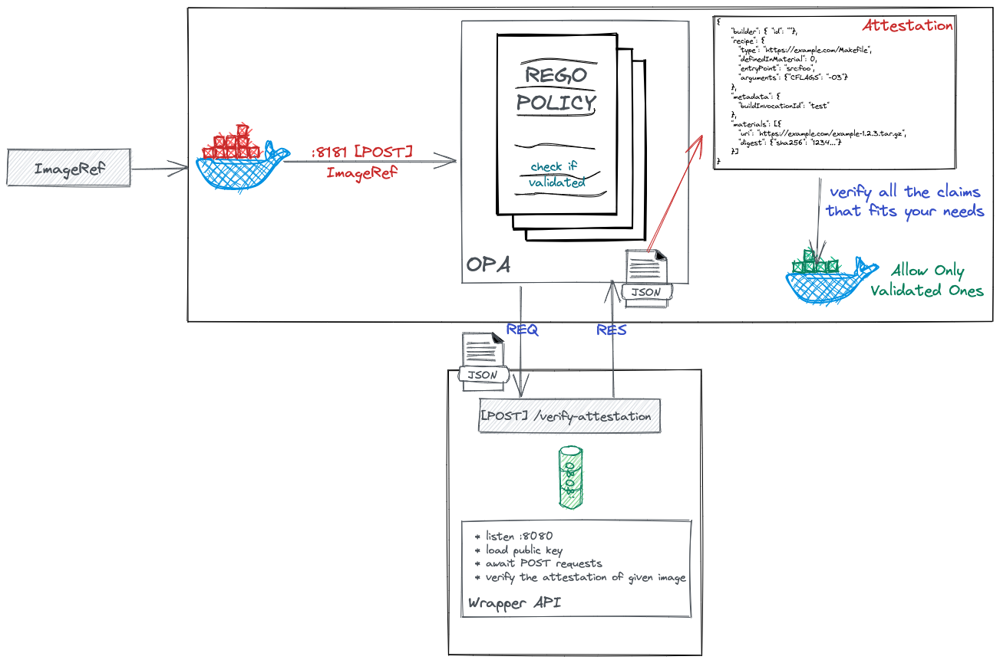

# Sign Container Images with cosign and Verify signature by using Open Policy Agent (OPA)


In the beginning, I believe it is worth saying that this project is just a proof-of-concept project that shows people how they can use cosign and OPA (Open Policy Agent) together to implement the signing and verifying container image process together.

In most basic form, [cosign](https://github.com/sigstore/cosign) is a container signing tool; it helps us to sign and verify container images by using the signature algorithm (ECDSA-P256) and payload format ([Red Hat Simple Signing](https://www.redhat.com/en/blog/container-image-signing)).

[Dan Lorenc](https://twitter.com/lorenc_dan), who is one of the maintainers of the project, wrote an excellent article about what cosign is and the motivation behind it; you can follow the [link](https://blog.sigstore.dev/cosign-signed-container-images-c1016862618) to access it.

On the other hand side, the Open Policy Agent (OPA, pronounced "oh-pa") is an open-source, general-purpose policy engine that unifies policy enforcement across the stack. So, the motivation behind using this kind of policy engine is providing an easy way of enforcing organizational policies across the stack.

## What is the motivation for combining both cosign and OPA?

Let's assume that we have to ensure only the images that have valid signatures can be deployed into production-grade Kubernetes clusters. So, to implement this kind of scenario is that we can use OPA's [http.send](https://www.openpolicyagent.org/docs/latest/policy-reference/#http) built-in function to call some external service an HTTP server that exposes `/verify` endpoint and uses `cosign` under the hood to verify the signature of an image.

## Tutorial

### High-Level Overview

This is what we want to achieve at the end of the day:

[](./.res/arch.png)

### Prerequisites

* [go v1.16.5](https://github.com/golang/go)
* [opa v0.30.2](https://github.com/open-policy-agent/opa)
* [cosign v0.6.0](https://github.com/sigstore/cosign)

### Demonstration

#### 0. Creating sample Rego Policy

1. Define the `package`:

```rego
package signature
```

2. Define the `verified` flag:

```rego
default verified = false
```

3. Define the rule:

```rego
verified {
    # read the `image` from the `input` that will be verified
    body := { "image": input.image }
    
    # hardcoded consts
    headers_json := { "Content-Type": "application/json" }
    cosignHTTPWrapperURL := "http://localhost:8080/verify"

    # send HTTP POST request to cosign-wrapper
    output := http.send({"method": "post", "url": cosignHTTPWrapperURL, "headers": headers_json, "body": body})
    
    # check if result verified
    output.body.verified
}
```

**P.S:** In this demo, we used the `http`, and ignored the `authentication` process. Better use the `https`.

#### 1. Run the OPA Server with pre-loaded [Rego policies](rego)

```bash
$ opa run --server rego

{"addrs":[":8181"],"diagnostic-addrs":[],"level":"info","msg":"Initializing server.","time":"2021-07-14T23:19:49+03:00"}
```

#### 2. Generate Key-Pair using Cosign

```bash
$ cosign generate-key-pair
```

#### 3. Test with an Image

`input.json`:

```json
{ "input": { "image": "gcr.io/developerguy-311909/ubuntu:unsigned"} }
```

* Test with _unsigned_ image:

```bash
$ curl -X POST :8181/v1/data/signature/verified -H "Content-Type: application/json" -d "@input.json"
{"result":false}

# OPA Log
{"client_addr":"[::1]:62078","level":"info","msg":"Sent response.","req_id":2,"req_method":"POST","req_path":"/v1/data/signature/verified","resp_bytes":16,"resp_duration":2.107975,"resp_status":200,"time":"2021-07-14T23:22:47+03:00"}
```

* Sign:

```bash
$ cosign sign -key cosign.key $IMAGE
Pushing signature to: ...
```

* Test with _signed_ image:

```bash
$ curl -X POST :8181/v1/data/signature/verified -H "Content-Type: application/json" -d "@input.json"
{"result":true}
```


## Furthermore

You should notice that we worked on the local environment to make that happen; of course, there is an alternative way of implementing this kind of demonstration. You can do the same in the Kubernetes environment. To do that, you can use OPA Gatekeeper, which is a customizable AdmissionWebhook, instead of using just OPA in the bare minimum and running `cosign-http-wrapper` as a `Pod.`

## Conclusion

You can implement a way of protecting Kubernetes clusters from an unsigned image by just using cosign and OPA seamlessly.
