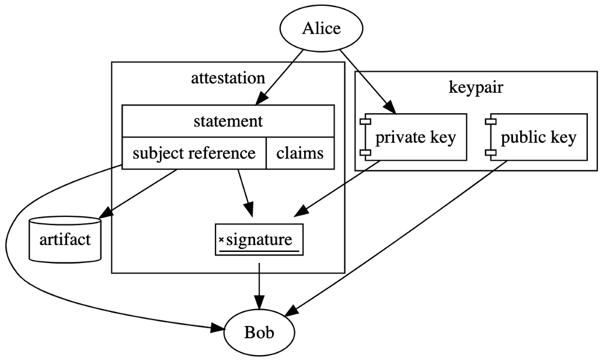

# Sign Attestation with cosign and Verify Attestation and its claims by using Open Policy Agent (OPA)



> Credit: https://dlorenc.medium.com/policy-and-attestations-89650fd6f4fa

In the beginning, I believe it is worth saying that this project is just a proof-of-concept project that shows people how they can use cosign and OPA (Open Policy Agent) together to implement the signing and verifying attestations.

[cosign](https://github.com/sigstore/cosign) can help us to sign and verify attestations based on [in-toto attestation specs](https://github.com/in-toto/attestation).

[Dan Lorenc](https://twitter.com/lorenc_dan), who is one of the maintainers of the project, wrote an excellent article about what Policy and Attestations are and the motivation behind it; you can follow the [link](https://dlorenc.medium.com/policy-and-attestations-89650fd6f4fa) to access it.

On the other hand side, the Open Policy Agent (OPA, pronounced "oh-pa") is an open-source, general-purpose policy engine that unifies policy enforcement across the stack. So, the motivation behind using this kind of policy engine is providing an easy way of enforcing organizational policies across the stack.

## What is the motivation for combining both cosign and OPA?

Let's assume that we have to ensure only the images that have valid signatures can be deployed into production-grade Kubernetes clusters. So, to implement this kind of scenario is that we can use OPA's [http.send](https://www.openpolicyagent.org/docs/latest/policy-reference/#http) built-in function to call some external service an HTTP server that exposes `/verify` endpoint and uses `cosign` under the hood to verify the signature of an image.

## Tutorial

### High-Level Overview

This is what we want to achieve at the end of the day:

[](./.res/arch.png)

### Prerequisites

* [go v1.16.6](https://github.com/golang/go)
* [opa v0.31.0](https://github.com/open-policy-agent/opa)
* [cosign v1.0.0](https://github.com/sigstore/cosign)

### Demonstration

#### Create sample Rego Policy

1. Define the `package`:

```rego
package signature
```

2. Assign default value to the `allow_attestation` rule:

```rego
default allow_attestation = false
```

3. Create the rule body:

```rego
allow_attestation {
    # send HTTP POST request to cosign-wrapper
    body := {
    	"image": input.image,
    }
    headers_json := {"Content-Type": "application/json"}
    cosignHTTPWrapperURL := "http://localhost:8080/verify-attestation"
    output := http.send({"method": "post", "url": cosignHTTPWrapperURL, "headers": headers_json, "body": body})
    p := json.unmarshal(base64.decode(output.body.payload))
    contains(p.predicate.Data, "{ \"id\": \"internal ci/cd platform\"}") # we are checking the image's builder id
}
```

**P.S:** In this demo, we used the `http`, and ignored the `authentication` process. Better use the `https`.

#### Run the OPA Server with pre-loaded [Rego policies](rego)

```bash
$ opa run --server rego/attestation_verify.rego

{"addrs":[":8181"],"diagnostic-addrs":[],"level":"info","msg":"Initializing server.","time":"2021-07-14T23:19:49+03:00"}
```

#### Upload your attestation file

Here is the attestation file that fits into [Provenance spec](https://github.com/in-toto/attestation/blob/main/spec/predicates/provenance.md) of in-toto's attestation specs.
```json
{
    "builder": { "id": "internal ci/cd platform"}, 
    "recipe": {
      "type": "https://example.com/Makefile",
      "definedInMaterial": 0,      
      "entryPoint": "src:foo", 
      "arguments": {"CFLAGS": "-O3"}         
    },
    "metadata": {
      "buildInvocationId": "test"
    },
    "materials": [{
      "uri": "https://example.com/example-1.2.3.tar.gz",
      "digest": {"sha256": "1234..."}
    }]
}
```


```bash
$ cosign attest -predicate myfirstattestation -key cosign.key devopps/alpine:3.12.1
```


#### Test

`input.json`:

```json
{ "input": { "image": "devopps/alpine:3.12.1"} }
```

* Test rule:

```bash
$ curl -X POST :8181/v1/data/signature/allow_attestation -H "Content-Type: application/json" -d "@input.json"
{"result":true}

# OPA Log
{"client_addr":"[::1]:62078","level":"info","msg":"Sent response.","req_id":2,"req_method":"POST","req_path":"/v1/data/signature/verified","resp_bytes":16,"resp_duration":2.107975,"resp_status":200,"time":"2021-07-14T23:22:47+03:00"}
```

## Furthermore

You should notice that we worked on the local environment to make that happen; of course, there is an alternative way of implementing this kind of demonstration. You can do the same in the Kubernetes environment. To do that, you can use OPA Gatekeeper, which is a customizable AdmissionWebhook, instead of using just OPA in the bare minimum and running `cosign-http-wrapper` as a `Pod.`

## Conclusion

You can implement a way of protecting Kubernetes clusters from an unsigned image by just using cosign and OPA seamlessly.
